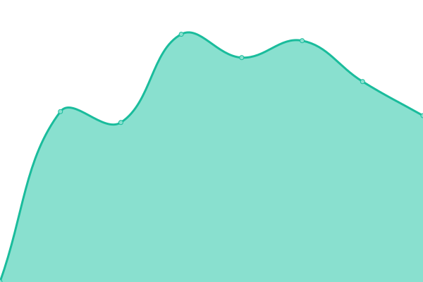
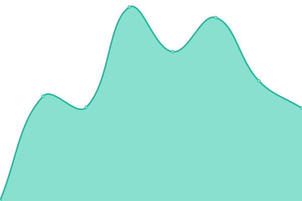

# [📈 Live Status](https://LGMOA-Oranziniai.github.io/Olimpiados.lt-monitor): <!--live status--> **Visos sistemos veikia**

Šioje saugykloje yra [Lietuvos Gamtos Mokslų Olimpiadų Asociacijos](https://github.com/LGMOA-Oranziniai/) atvirojo kodo puslapių stebėjimo ir būsenos puslapis, veikiantis su [Upptime](https://github.com/upptime/upptime).

<!--start: status pages-->
<!-- This summary is generated by Upptime (https://github.com/upptime/upptime) -->
<!-- Do not edit this manually, your changes will be overwritten -->
<!-- prettier-ignore -->
| URL | Status | History | Response Time | Uptime |
| --- | ------ | ------- | ------------- | ------ |
|  [Olimpiados.lt](https://olimpiados.lt) | Veikia | [olimpiados-lt.yml](https://github.com/LGMOA-Oranziniai/Puslapiu-stebejimas/commits/HEAD/history/olimpiados-lt.yml) | 

 1113ms
     
 | 

<a href="https://status.olimpiados.lt/history/olimpiados-lt">100.00%</a>
    

|  [LitMO puslapis](https://litmo.olimpiados.lt) | Veikia | [lit-mo-puslapis.yml](https://github.com/LGMOA-Oranziniai/Puslapiu-stebejimas/commits/HEAD/history/lit-mo-puslapis.yml) | 

 530ms
     
 | 

<a href="https://status.olimpiados.lt/history/lit-mo-puslapis">100.00%</a>
    

<!--end: status pages-->

[**Aplankykite mūsų stebėjimo puslapį →**](https://status.olimpiados.lt)

## 📄 Licencija

- Sukurta naudojant: [Upptime](https://github.com/upptime/upptime)
- Kodas: [MIT](./LICENSE) © [Anand Chowdhary](https://anandchowdhary.com)
- Duomenys kataloge `./history`: [Open Database License](https://opendatacommons.org/licenses/odbl/1-0/)
